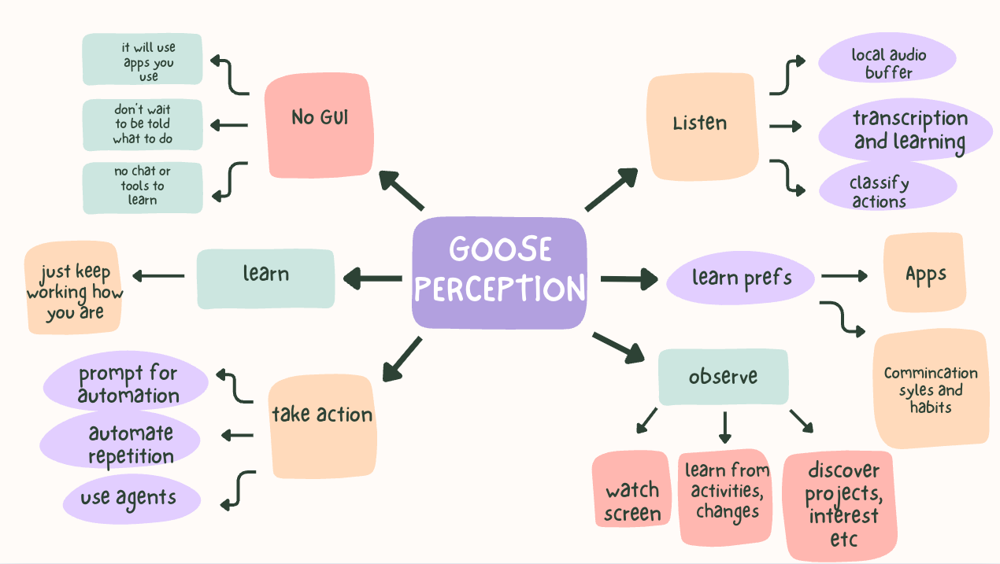
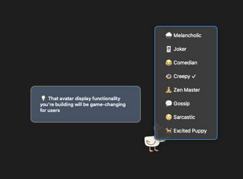
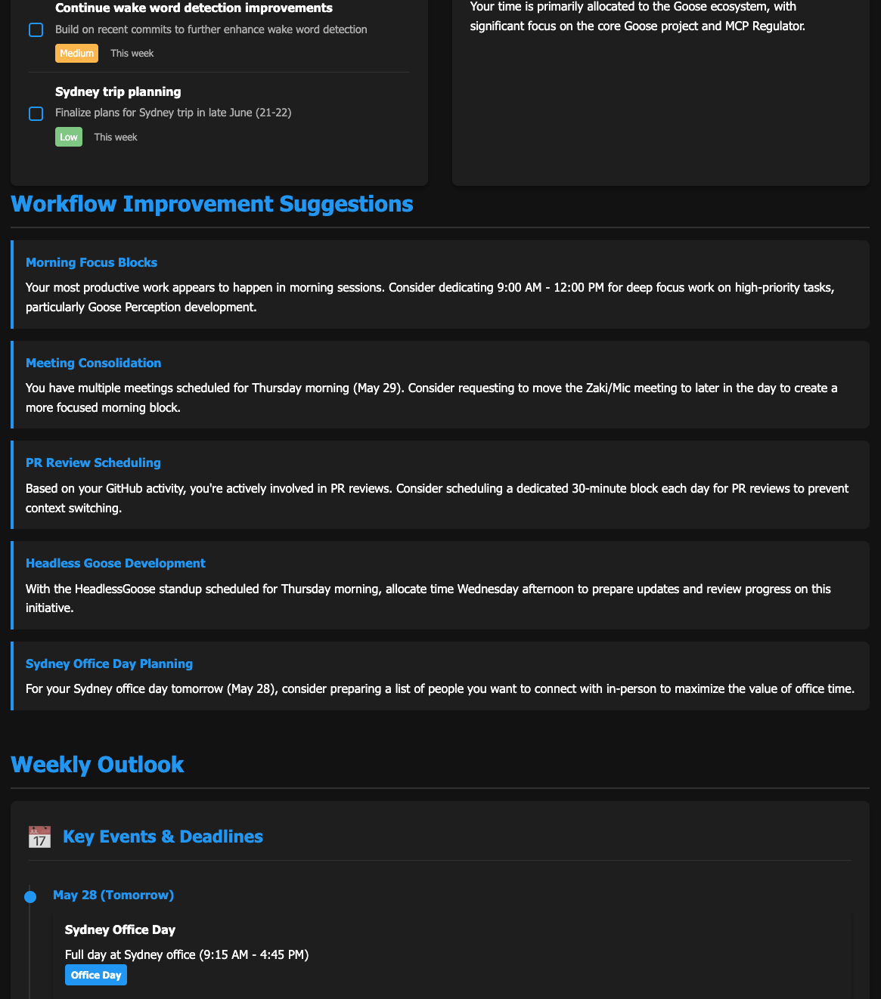
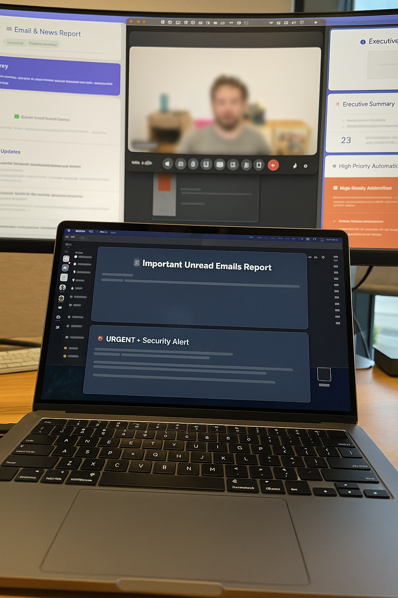

# Goose Perception

> [!WARNING]
> This is experimental and very much a work in progress and showcase of async goose and recipes, use at own risk.
> This will use LLM tokens on your behalf and at your cost in some cases (we are attempting to move more and more processing to all local models over time for privacy and cost)


What if you didn't have to learn how to use an agent, if it didn't wait for you to chat with it? That is this project. 



* What if goose noticed you missed a meeting and that you didn’t actually miss much? It could politely decline (or if you did miss something important, you will be politely interrupted with what actions you need to take)
* Say you made an offhand comment out loud while talking with a colleague but forget to follow it up (that can be automated for you)
* Leave a note to prepare some research (wherever you keep notes today) - and it will happen
* Maybe you get an important message from a trusted colleague about a regression while you are busy doing something else - let goose take action for you in the background, submit a fix
* Perhaps you forget to update some document or spreadsheet that you need to. 
* You don’t want to check your unread messages in the morning, can't an agent know what you are working on and interrupt you if it affects you otherwise schedule time to do it? (after all, it should know everything about you)
* You could update the team when something interesting happens without having to think about it 
* Goose can watch how you work, who you talk to to, how your day works, what apps you like to use, and can preemptively automate tasks for you. It can learn your preferences, communication styles, hear what you talk about, offer to take on tedious tasks or prepare. 
* This can be done with "recipes" you can control
* Goose can also fix its own issues, enhance its own automation as time goes on, the more you use it.
* You might have an upcoming presentation and haven't had time to think about it, goose will prepare it for you

Goose perception runs on your desktop and learns from how you work, without any interaction on your part, you just go about your day. It makes use of a plethora of MCPs and agent capabilities to achieve this, along with local models, voice processing and classifiers.
This is the most personal way to build up a background assistant that can take actions on your behalf, with out you needing to learn another tool (it will even use agents that you use if it sees them). Just keep going, and goose will help you out. 

## Quick start 

Run this via `just run` and let it observe how you work (watch and listen), in the background it will then learn, and start doing work for you (carefully!) and suggesting things, reminding you etc.
Always watching, and listening and perceiving and then acting. If this is all to much `just run-simple` will run just the recipesd (no voice or other enhancements)


## 🎭 Avatar Personality System

> **Goose perception has a fun or creepy avatar that will lurk on your screen** - See [AVATAR_SYSTEM.md](AVATAR_SYSTEM.md) for details about the floating avatar system that provides visual feedback and suggestions.

The avatar provides different types of suggestions based on your activity:

- **🔍 Work Pattern Alerts**: "I've been watching your workflow... Want me to automate it?"
- **📅 Meeting Notices**: "Your next meeting starts in 10 minutes. Should I prepare the agenda?"
- **🎯 Focus Suggestions**: "I notice you're switching between tasks frequently. Want help prioritizing?"
- **⚡ Optimization Tips**: "I could automate that repetitive task you just did..."

and may offer to do things for you.


The avatar brings life to Goose Perception with **8 distinct personalities** - not just different work styles, but genuinely unique characters with their own traits, quirks, and ways of seeing the world. Each personality fundamentally changes how the avatar interacts with you.



### Available Personalities

- **🌧️ Melancholic**: Brooding and introspective, finds beauty in struggle and poetic meaning in mundane tasks
- **🃏 Joker**: Chaotic and unpredictable, loves pranks and unconventional approaches 
- **😂 Comedian** *(Default)*: Always cracking jokes and finding humor in everything
- **👁️ Creepy**: Unsettling and mysterious, makes eerily accurate observations about your patterns
- **🧘 Zen Master**: Wise and peaceful, speaks in riddles and philosophical insights
- **💬 Gossip**: Chatty and dramatic, loves to "spill tea" about your code and projects
- **🙄 Sarcastic**: Dry wit and cutting sarcasm delivered with perfect timing
- **🐕 Excited Puppy**: Boundlessly enthusiastic about absolutely everything

### How to Change Personalities


1. **Right-click the avatar** to open the personality selection menu
2. **Select a personality** from the dropdown (current selection marked with ✓)
3. **Watch the costume change** - entertaining transition messages like "🎭 Switching to Sarcastic mode..."
4. **Experience complete consistency** - all suggestions, responses, and interactions match the chosen personality

### Personality Examples

Each personality provides dramatically different experiences:

- **🌧️ Melancholic**: *"Ah, another click in this endless digital void... how beautifully tragic your code becomes in these moments of despair."*
- **🃏 Joker**: *"CHAOS CLICK! What havoc shall we wreak today? Plot twist: your function might actually work!"*
- **🙄 Sarcastic**: *"Oh wow, another click. How revolutionary. Let me guess, you want me to do something 'helpful'?"*
- **🐕 Excited Puppy**: *"OH MY GOSH YOU CLICKED ME! THIS IS SO EXCITING! WOW WOW WOW!"*

### Smart Features

- **🔄 Message Queue System**: Prevents competing messages, ensures smooth sequential display
- **💾 Persistent Settings**: Your chosen personality is saved and restored across restarts
- **🧵 Thread-Safe Operations**: Background personality changes don't freeze the UI
- **🎯 Complete Consistency**: Every interaction maintains the same personality voice
- **⚡ Priority Handling**: Important actionable messages get proper queue priority

> **Pro Tip**: The personality system uses Goose's recipe parameter system, so each personality gets uniquely generated content rather than just different templates!

## 🎯 Interactive Action Menu

The avatar now features a **smart action menu** that appears when you click it! Instead of just showing messages, the avatar presents you with immediate access to its most useful functions through a beautiful, personality-aware interface.


### 🚀 Quick Actions at Your Fingertips

When you **click the avatar**, you'll see a personality-specific greeting followed by **6 action buttons**:

- **📊 Run Report** *(Blue)*: Generate optimization analysis (same as `Cmd+Shift+R` hotkey)
- **🎤 Listen to Me** *(Red)*: Activate voice listening mode with helpful instructions  
- **💬 Enter Prompt** *(Green)*: Open text input dialog for direct requests
- **📋 Show Status** *(Purple)*: Display real-time system information and diagnostics
- **🎭 Change Personality** *(Orange)*: Quick access to personality switching (redirects to right-click)
- **📝 Recent Work** *(Gray)*: View your latest work activity and summaries

### 🖥️ System Status Display

The **Show Status** action provides comprehensive system information at a glance:


- **💻 Real-time Performance**: CPU usage, memory consumption
- **🔄 Observer Status**: Whether background recipes are running
- **📝 Work Logs**: Status of work activity tracking files
- **🎭 Current Personality**: Active personality mode
- **📊 Message Queue**: Number of queued messages
- **🏠 System Health**: Perception directory status and timestamp

### ✨ Smart Features

- **🎭 Personality-Aware Greetings**: Each personality has unique, character-appropriate messages
- **🎨 Color-Coded Actions**: Visual organization with intuitive color scheme
- **⏱️ Auto-Dismiss**: Menu automatically closes after 60 seconds if unused
- **🔄 Thread-Safe Execution**: All actions run in background without blocking the UI
- **📱 Responsive Design**: Fixed-width layout that grows upward from the avatar
- **🛡️ Error Handling**: Graceful fallbacks if system information isn't available

### 🎭 Personality Examples

The greeting changes based on your avatar's personality:

- **🙄 Sarcastic**: *"Let me guess, you want me to do something helpful?"*
- **🃏 Joker**: *"PLOT TWIST! You want me to actually DO something?!"*
- **🌧️ Melancholic**: *"In this digital void, what task calls to you?"*
- **🐕 Excited Puppy**: *"OH MY GOSH YES! HOW CAN I HELP YOU TODAY?!"*

### 🔧 How to Use

1. **Single-click** the avatar to open the action menu
2. **Choose an action** by clicking any of the colorful buttons  
3. **Follow the prompts** for text input or voice activation
4. **View results** through notifications and status updates
5. **Double-click** the avatar if a message gets stuck (emergency dismiss)

> **Note**: The action menu replaces the old avatar state cycling behavior, providing much more useful functionality while maintaining the avatar's personality and charm!

This makes use of many goose powered agents (which use "recipes") to observe you as you go about your day, learn about your work, projects and more so it can suggest improvements and take actions. 
It works by watching how you work (screens, interactions, collaboration) and literally listening, uses many MCPs and recipes asynchronously.




It also includes an audio agent activation tool using local transcription models, with custom wake word detection model and conversation capture.
No audio leaves your machine (but you can dictate or tell it intructions, not for conversation, but to give it instructions)


Some of the recipes for example will prompt you when appropriate with suggestions on how to order your tasks or day.
It will communicate with you via notifications (if it must), voice, or presenting ideas and reports from time to time: 


## Usage day to day

Once running - just go about your day, you don't need to do anything, it will do something. 

### Avatar Click Menu
**Click the avatar** to open an interactive action menu with 6 helpful functions like running reports, voice activation, text prompts, and system status.

### Voice Activation
You can ask goose to do something by talking - just mention "goose", it will detect that you are talking to it (vs about it).

### 🎭 Emotion Detection System
Goose features a **state-of-the-art AI-powered emotion detection system** that automatically detects your emotional state every 1 minute using your webcam. This helps understand your work patterns, stress levels, and optimal productivity times.

#### 🚀 Modern AI Detection
- **DeepFace Neural Networks**: Uses pre-trained emotion recognition models for high accuracy
- **Multi-Method Fallback**: DeepFace → OpenCV → brightness-based detection  
- **Real-time Confidence Scoring**: 84-100% confidence scores with detailed emotion breakdowns
- **7 Emotion Categories**: Happy, neutral, sad, angry, surprised, fear, disgust

#### 🎯 Smart Calibration System
The emotion detection includes comprehensive calibration to improve accuracy for your specific expressions:

- **Personal Baseline Calibration**: Learn what YOUR neutral/happy/sad expressions look like
- **Confidence Threshold Tuning**: Automatically optimize detection sensitivity
- **Temporal Smoothing**: Reduce noise while preserving genuine emotional changes
- **Manual Feedback Corrections**: Correct wrong detections to improve future accuracy
- **Environmental Adaptation**: Account for your lighting, camera angle, and setup

#### 🛠️ Calibration Tool
Use the interactive calibration tool to optimize emotion detection:

```bash
uv run calibrate_emotion_detection.py
```

**Available Calibration Options:**
1. **Check calibration status** - See current settings and recommendations
2. **Calibrate confidence threshold** - Optimize detection sensitivity with 10 test detections
3. **Personal baseline calibration** - Train on your neutral, happy, and sad expressions
4. **Manual feedback corrections** - Improve accuracy by correcting wrong detections
5. **Calibration strength adjustment** - Control responsiveness vs stability (0.0-1.0)
6. **Live testing** - Compare calibrated vs uncalibrated detection in real-time

#### 📊 Detection Features
- **Emotion History Tracking**: Maintains rolling log of emotions with timestamps
- **Confidence-Based Filtering**: Only reports emotions above your calibrated threshold
- **Smart Temporal Smoothing**: Preserves high-confidence emotions while reducing noise
- **Fallback Gracefully**: Works even if AI models fail to load
- **Privacy-First**: All processing happens locally on your machine

#### 🎛️ Customization
- **Calibration Strength**: Adjust from 0.0 (raw AI, most responsive) to 1.0 (maximum stability)
- **Detection Interval**: Configurable timing between emotion checks (default: 1 minute)
- **Manual Override**: Create emotion overrides for testing or specific needs
- **Logging Options**: Detailed emotion logs with method tracking and confidence scores

The avatar system uses this emotion data to provide context-aware suggestions and adapts its personality based on your emotional state. When emotion detection is disabled, the system gracefully falls back to neutral defaults.

### Hotkey Activation  
- **`Cmd+Shift+G`**: Capture your screen and give Goose an instruction about what to do with it
- **`Cmd+Shift+R`**: Run optimization analysis and generate HTML5 reports

All methods work asynchronously and Goose will process your requests in the background.

## What it can do for you

  
  
> [!NOTE]
> This is a real screenshot (blurred with AI) of a meeting where it was early morning, and goose was prepping me for the day, noting any important actions in slack and email I needed to take (knowing that I am terrible at reading email until much later in the day).
    
Let it run for a while (ie run it all the time in the background), over time goose will start either showing things to you (with windows showing up with little web apps or reports), it will put things quietly on your calendar to remind you, prepare documents for you for up coming things, it may even patch code and open pull requests if something important and urgent happens and your attention is elsewhere.
    
For example it will do a weekly "hype doc" summary celebrating all your hard work! There are many other things it may do, they all combine together as it learns what you do.
it knows when you are in a meeting, and can use the dialog to help you not miss follow up items and take action on them.

You will see things appear in your calendar (if you have the gcal integration enabled), notes in your notes app etc - it will work out where you manage things and interact there.


It may even tell you (congratulate?) it is time to take a break based on recent activity (like this!)
  

> [!TIP]
> you can leave notes for goose to work on in your notes app, and it will act on them, and report back to them etc.


You can also use verbal commands to ask it to do something (and it has the benefit of that learned context). 
A normal goose session can also benefit from this context as well. 


## Setup

Prerequisites:
- `just` command runner
- macOS (for hotkey functionality)

The application will:
1. Create a virtual environment with Python 3.12
2. Install all required dependencies
3. Download models when first needed
4. Train the classifiers on first run

### macOS Permissions

For the hotkey functionality (`Cmd+Shift+G`) to work, you may need to grant permissions:

1. **Accessibility**: System Preferences → Security & Privacy → Privacy → Accessibility
   - Add Terminal or your Python executable to allow hotkey detection
2. **Screen Recording**: System Preferences → Security & Privacy → Privacy → Screen Recording
   - Add Terminal or your Python executable to allow screenshot capture

> **Note:** The application sets `TOKENIZERS_PARALLELISM=false` to avoid warnings from the Hugging Face tokenizers library. If you run into any issues with tokenizers, you can manually set this environment variable: `export TOKENIZERS_PARALLELISM=false`

### Available Commands

```bash
just run              # Run the application
just run-simple       # Run the application without voice or avatar features (just recipes)
just train-classifier # run the classifier (won't usually need to)
just status           # to check what is running
just logs             # to follow along with background things going on
just test             # run all automated tests
just test-avatar      # run interactive avatar test (opens GUI)
just test-emotion     # test emotion detection immediately (bypass 5-minute timer)
just kill             # kill switch
```

### 🎭 Emotion Detection Commands

```bash
# Setup and test the emotion detection system
uv run setup_emotion_detection.py         # Install dependencies and test system
uv run test_emotion_detection.py          # Compare old vs new emotion detection
uv run test_emotion_detection.py --live   # Live emotion detection test (5 detections)
uv run calibrate_emotion_detection.py     # Interactive calibration tool

# Direct testing
uv run emotion_detector_v2.py             # Test the emotion detector directly
```


## Models and data

The voice models (currently whisper) and locally trained models (distilbert based) all run locally when listening in to the environment and for commands, no audio leaves your machine. 
Screen shots are taken periodically but cleaned out, goose is used to summarised those into a rolling log

### Local models and personal data

... This area is heavily under development ...

Goose will use whatever default models are configured for it, so they can be local models, but if they are remote ones then screenshots will be sent as will information that other recipes gather. 
For running all locally, this is possibly by via goose config, but also possibly with screen analysis with ollama models which are fine tuned for screen analysis 
There are models such as `llava:3b` (ideally 13b or up) which can read screen content for summarization, but need to be used in concert with other models (think of it as mode like fancy OCR!)
This is an emerging space so keep an eye out

Voice information is kept local as are transcriptions, image processing is done by goose and the images removed after use.

**Emotion Detection Models**: The emotion detection system uses DeepFace with pre-trained neural networks that download automatically on first use (~50MB). All emotion detection processing happens locally on your machine - no images or emotion data leave your computer. The system gracefully falls back to OpenCV-based detection if the AI models fail to load.


## How It Works

# Observing and learning

The `observers` directory has many recipes for learning about you - these will run from time to time, some continuously. 
Goose recipes running in the background are key to how perception works. 


* a recipe is recalling meeting information, and looking for any spoken content during that time

### Screen watching

The `work` recipe looks at your screen content and will summarise, learn and note what you are working on, who you interact with, and what has changed. It will even work out when you are asleep (well not at your computer).
This keeps a rolling log of activity and up to date latest one.

### Interactions and contributions

other recipes will examine your communications history and contributions, and form a picture and some metrics of what you have been doing recently and with whom. 
They will then proactively go to work (checkout `observers` dir).

# Actions
The actions directory contain many action "recipes" that will take action when directed or when decided (in the background) are warranted.


# Voice commands

Voice input is useful as it is always listening and knows the context of which you ask for something to be done. Best for async tasks, not conversation.

# Hotkey commands

The system now includes a **hotkey-activated screen capture feature** that allows you to quickly capture your screen and have Goose analyze it.

- **Hotkey**: `Cmd+Shift+G` (press and hold all three keys)
- **Process**: Captures screen → Shows input dialog → Processes with Goose
- **Use cases**: Code review, document analysis, UI interaction, task automation

See [HOTKEY_FEATURE.md](HOTKEY_FEATURE.md) for detailed documentation.

# Audio processing flow

The application uses a sequential processing approach with continuous audio capture:

### Wake Word Detection Flow

1. **Audio Capture** (continuous background thread)
   - Captures audio from the microphone in real-time
   - Buffers audio in a queue for processing
   - Runs in a separate thread that never blocks

2. **Audio Processing** (main thread)
   - Collects 5-second chunks of audio from the queue
   - Saves each chunk to a temporary file
   - Submits the chunk for transcription in a background thread

3. **Transcription** (background thread)
   - Transcribes the audio chunk using Whisper
   - Runs in a background thread to avoid blocking audio capture
   - Returns the transcribed text to the main thread

4. **Wake Word Detection** (main thread)
   - Checks if the transcribed text contains "goose"
   - If found, uses the classifier to determine if it's addressed to Goose
   - The classifier check is fast and doesn't block audio capture

5. **Mode Switching**
   - If addressed to Goose: switches to active listening mode
   - If not: stays in passive listening mode

The system maintains continuous audio capture throughout all these steps, ensuring no audio is missed during processing or classification.

### Wake Word Detection

The system uses an enhanced ML-based classifier to determine if speech is addressed to Goose:

- **Two-Model Approach**: Uses a lightweight model (tiny) for wake word detection and a higher-quality model for full transcription
- **Fuzzy Text Matching**: Can detect variations of "goose" using fuzzy string matching
- **Confidence Thresholds**: Configurable confidence threshold for wake word classification
- **ML-Based Classification**: Uses a fine-tuned DistilBERT model to determine if speech is addressed to Goose
- **More accurate and context-aware** than simple text matching
- **Can distinguish** between mentions of "goose" and actual commands to Goose

```
┌────────────────────┐     ┌────────────────────┐     ┌────────────────────┐
│                    │     │                    │     │                    │
│   Audio Capture    │────▶│  5-second Chunks   │────▶│ Quick Transcription│
│  (Background)      │     │  (Main Thread)     │     │ (Lightweight Model)│
│                    │     │                    │     │                    │
└────────────────────┘     └────────────────────┘     └──────────┬─────────┘
                                                                 │
                                                                 ▼
┌────────────────────┐                             ┌─────────────────────────┐
│                    │                             │                         │
│  Passive Listening │◀────────── No ─────────────┤ Contains "goose"?        │
│                    │                             │ (Fuzzy Match)           │
└────────────────────┘                             └─────────────┬───────────┘
                                                                 │
                                                                Yes
                                                                 │
                                                                 ▼
┌────────────────────┐                             ┌─────────────────────────┐
│                    │                             │                         │
│  Passive Listening │◀────────── No ─────────────┤  Addressed to Goose?     │ 
│                    │                             │  (Classifier Check)     │
└────────────────────┘                             └─────────────┬───────────┘
                                                                 │
                                                                Yes
                                                                 │
                                                                 ▼
┌────────────────────┐                             ┌─────────────────────────┐
│                    │                             │                         │
│  Switch to Active  │─────────────────────────────▶  Active Listening       │
│  Mode              │                             │  (Main Model)           │
└────────────────────┘                             └─────────────┬───────────┘
                                                                 │
                                                                 ▼
                                                   ┌─────────────────────────┐
                                                   │                         │
                                                   │  Monitor Until Silence  │
                                                   │                         │
                                                   └─────────────┬───────────┘
                                                                 │
                                                                 ▼
                                                   ┌─────────────────────────┐
                                                   │                         │
                                                   │  Full Transcription     │
                                                   │  (Using Main Model)     │
                                                   └─────────────┬───────────┘
                                                                 │
                                                                 ▼
                                                   ┌─────────────────────────┐
                                                   │                         │
                                                   │   Save Conversation     │
                                                   │                         │
                                                   └─────────────┬───────────┘
                                                                 │
                                                                 ▼
                                                   ┌─────────────────────────┐
                                                   │                         │
                                                   │   Invoke Goose Agent    │
                                                   │   (via agent.py)        │
                                                   └─────────────┬───────────┘
                                                                 │
                                                                 ▼
                                                   ┌─────────────────────────┐
                                                   │                         │
                                                   │   Goose Process         │
                                                   │   (Background Thread)   │
                                                   └─────────────────────────┘
```

### Multi-Scale Transcription System

1. **Short Chunks (5 seconds)**
   - Used for real-time monitoring and wake word detection
   - Provides immediate feedback on what's being heard
   - Serves as building blocks for longer transcriptions

2. **Context Buffer (30 seconds)**
   - Maintains a rolling window of recent speech
   - Preserves what was said before the wake word
   - Composed of multiple 5-second chunks

3. **Active Listening (Variable Length)**
   - Triggered when wake word is detected
   - Continues until silence is detected (default: 3 seconds of silence)
   - Captures the complete interaction after the wake word

4. **Full Conversations**
   - Combines context buffer + active listening period
   - Captures speech before, during, and after wake word
   - Re-transcribes the entire audio using the main model
   - Saved as complete audio and transcript files


### Operating Modes

#### Passive Listening Mode
1. Captures audio from your microphone in real-time (continuous)
2. Processes the audio in 5-second chunks (sequential)
3. Maintains a rolling buffer of recent speech (default: 30 seconds)
4. Continuously monitors for the wake word "goose"
5. Shows minimal output to indicate it's working

#### Active Listening Mode
1. Triggered when the wake word is detected and verified by the classifier
2. Preserves the context from before the wake word was spoken
3. Continues actively transcribing all speech
4. Monitors for a period of silence (default: 3 seconds)
5. When silence is detected, saves the entire conversation (context + active speech)
6. Returns to passive listening mode

During active listening, the system prioritizes capturing the complete conversation. It continues to buffer audio in the background, ensuring no speech is missed even during transcription.

### Conversation Capture
- Complete conversations are saved as both audio (.wav) and text (.txt) files
- Files are stored in the `recordings` directory with timestamps
- Each conversation includes speech from before the wake word was detected

### Activation Logging for Training
- The system logs all wake word activations for analysis and model improvement
- Successful activations are saved as `activation_triggered_[timestamp].txt`
- Bypassed activations (when "goose" is detected but not addressed to Goose) are saved as `activation_bypassed_[timestamp].txt`
- Each log includes the transcript, confidence score, and timestamp
- These logs can be used to retrain the wake word classifier to improve accuracy

### Agent Integration

The system directly integrates with Goose through the `agent.py` module:
- When a conversation is complete, `perception.py` directly calls `agent.process_conversation()`
- The agent reads the transcript and prepares it for Goose with appropriate instructions

#### Concurrency Model

The system uses a multi-threaded approach to handle Goose interactions:

1. **Main Thread (perception.py)**
   - Detects wake words, processes conversations
   - Calls `agent.process_conversation()` when a conversation is complete
   - Continues listening for new wake words immediately

2. **Agent Thread (agent.py)**
   - Created by `agent.process_conversation()`
   - Runs `run_goose_in_background()` in a daemon thread
   - Daemon threads don't block program exit

3. **Goose Process**
   - Started by the agent thread using `subprocess.call()`
   - Runs the Goose CLI with the transcript
   - Operates independently from the main application

This design ensures that:
- The voice recognition system continues to function while Goose processes requests
- Multiple conversations can be handled sequentially
- The application remains responsive during Goose processing

#### Continuous Conversation Support

The system supports continuous conversations without requiring silence between commands:

- During active listening, it continues to monitor for additional wake words
- If a wake word is detected during active listening, the silence counter is reset
- This allows for chained commands without waiting for silence
- Example: "Hey Goose, what's the weather? Hey Goose, set a timer for 5 minutes."


### Background Transcription

The system uses a background thread for transcription:

- **Non-blocking Design**: Audio capture continues even during transcription
- **Sequential Processing**: Each audio chunk is processed in order
- **Reliable Wake Word Detection**: The system processes each chunk fully before moving to the next
- **Focused Attention**: Once activated, the system captures the entire conversation without interruption
